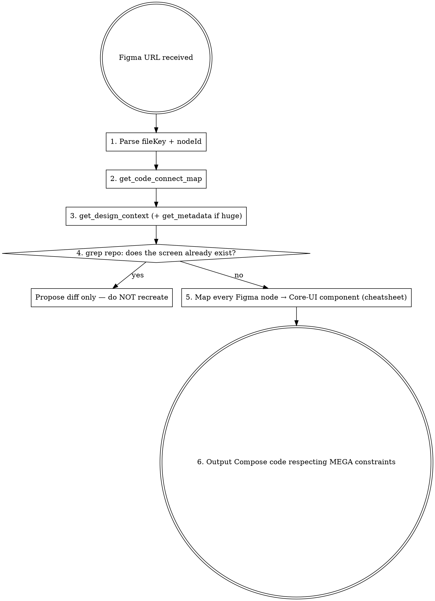

# Figma → MEGA Compose Skill

Translate Figma designs into MEGA Android Jetpack Compose code, reusing Core-UI components and project conventions. Composes on top of `figma:figma-implement-design` (generic) by adding MEGA-specific knowledge.

## When to use

- User pastes a `figma.com/design/...` or `figma.com/make/...` link and asks for Compose / Android code.
- User says "implement / build / translate this Figma in Compose".

## When NOT to use

- Editing an existing Compose UI without a Figma source → just edit the file.
- Writing nodes back into Figma → use `figma:figma-use`.
- Creating Code Connect mappings → use `figma:figma-code-connect`.

## Required workflow (6 steps — do not skip)

**Step details:**

1. **Parse URL** — `figma.com/design/:fileKey/:fileName?node-id=N-M` → `fileKey = :fileKey`, `nodeId = "N:M"` (replace `-` with `:`).
2. **`get_code_connect_map` first** — discover which Figma components already map to MEGA Compose. This is cheaper context than full design context and tells you what NOT to re-derive.
3. **`get_design_context`** — pull design + screenshot. If the response is truncated, run `get_metadata` for the node tree, then `get_design_context` per child.
4. **CRITICAL — verify the screen does not already exist.** Run grep with the Figma title (e.g. "Customise Home"), the implied NavKey name (`HomeConfiguration`), and obvious keyword patterns under `feature/`. If found, **report the existing file and propose a diff against Figma** instead of writing new code.
5. **Map components.** For every distinct Figma component in the design, look it up in `core-ui-cheatsheet.md`. Only consider building a new component when the cheatsheet has no entry AND grep confirms nothing equivalent exists in core-ui modules.
6. **Output Compose code** following the MEGA constraints below.

## MEGA constraints (non-negotiable)

- **Indentation:** 4 spaces, never tabs.
- **Layout:** `MegaScaffold` (not raw `Scaffold`).
- **Text / icons:** `MegaText`, `MegaIcon` — never Material `Text` / `Icon` directly.
- **Colors:** `DSTokens.colors.*`, `IconColor`, `TextColor`. **No hardcoded hex.**
- **Drawables:** `IconPack.<Size>.<Weight>.<Style>.<Name>` (e.g. `IconPack.Small.Thin.Outline.QueueLine`). Never import new icon packs.
- **Toggles:** `Toggle`, not Material `Switch`.
- **Destinations:** `@Serializable data object/class … : NavKey` + register in the matching `*FeatureGraph`.
- **ViewModels:** `@HiltViewModel` + constructor `@Inject` + `asUiStateFlow(viewModelScope, …)`. See `viewmodel-conventions.md`.
- **Imports must exist.** Before claiming a snippet is correct, grep each unfamiliar import in the repo. A name from training data is not proof.

## Downstream skills

After this skill outputs the Compose code, hand off file creation:

- New screen file + Destination → `screen` skill (`/screen create <Name> --module <path>`)
- New ViewModel → `viewmodel` skill
- New mapper → `mapper` skill
- New module → `create-module` skill

## Component cheatsheet

Detailed Figma node ↔ Core-UI Compose mapping with imports and a full Customise-Home translation example: see `core-ui-cheatsheet.md` in this directory. Always consult it in step 5 — do not reconstruct mappings from memory.

## Common mistakes

| Mistake | Fix |
|---|---|
| Skip `get_code_connect_map`, jump to `get_design_context` | Always step 2 first — it's cheaper and tells you what's already wired up. |
| Write new screen without grep | Step 4 is mandatory. The screen often already exists. |
| Paste Figma's React + Tailwind output as-is | Figma output is a *reference*; translate every line through the cheatsheet. |
| Use Material `Switch` / `Text` / `Icon` | Use `Toggle` / `MegaText` / `MegaIcon`. |
| Hardcode `Color(0xFF303233)` | Use `DSTokens.colors.text.primary` (or the token Figma cited). |
| Claim "done" before verifying imports compile | Grep every unfamiliar import in the repo before declaring success. |

## Red flags — STOP and reset

- "I'll just write a custom Switch / TopAppBar — Core-UI probably doesn't have it" → grep cheatsheet + `shared/original-core-ui` + `mega-core-ui` first.
- "The screen probably doesn't exist yet" → grep `feature/<area>` for the title and NavKey name.
- "Hardcoding the hex is faster" → token. Always.
- "The Figma React output already compiles to Kotlin in my head" → still translate via the cheatsheet.
